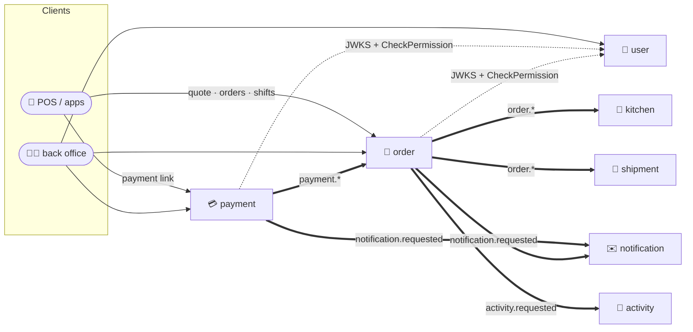

<div align="center">

# 🏃 RoRoJongRun

**Go microservices for ordering, paying and running a business — one monorepo, one framework.**


<p>
 
 
 
 
 
</p>

[Services](#-services) · [Architecture](#-architecture) · [Quick start](#-quick-start) · [Layout](#-monorepo-layout) · [candi cheatsheet](#-candi-cheatsheet)

</div>

---

Seven services, generated and kept consistent by the [candi](https://github.com/golangid/candi) CLI, following
[Clean Architecture](https://blog.cleancoder.com/uncle-bob/2012/08/13/the-clean-architecture.html) and the
[Standard Go Project Layout](https://github.com/golang-standards/project-layout). They share one Go module
(`monorepo`), run and deploy independently, call each other through generated SDKs (gRPC/REST) and talk through
Kafka events. Conventions for contributors (human or AI) live in **[CLAUDE.md](CLAUDE.md)**.

## 🧭 Services

| Service | What it does | Talks | Docs |
|---|---|---|---|
| 🔐 **[user](services/user)** | Multi-realm identity: login, RS256 JWT + JWKS, roles, permissions, menus, superadmin bootstrap | REST · GraphQL · gRPC | [realms & RBAC](services/user/docs/realms-and-rbac.md) |
| 💳 **[payment](services/payment)** | Payment links, checkout journey, Midtrans / Xendit / cash, DB-configured gateways and topics, outbox | REST · gRPC · Kafka in/out | [payment flow](services/payment/docs/payment-flow.md) |
| 🧾 **[order](services/order)** | The sales ledger: orders booked from payment events, order lifecycle, invoices, cash shifts, reports, CSV exports | REST · Kafka in/out | [order ledger](services/order/docs/order-ledger.md) |
| ✉️ **[notification](services/notification)** | DB-driven templates for email, push and OTP; fans out `notification.requested` | REST · Kafka in | — |
| 📜 **[activity](services/activity)** | Audit log & history feed; REST, or `activity.requested` over Kafka (order sends every change) | REST · Kafka in | swagger in `docs/` |
| 🚚 **[shipment](services/shipment)** | Courier assignment and delivery tracking | scaffolded | — |
| 🍳 **[kitchen](services/kitchen)** | Merchant order queue and prep status | scaffolded | — |

## 🏗️ Architecture



* **Synchronous** calls go through gRPC/REST clients generated in [`sdk/`](sdk) — a service never imports
  another service's `internal/`.
* **Asynchronous** fan-out goes through Kafka topics named `<service>.<event>`, published through
  transactional outboxes where losing an event is not an option (payment, order).
* **Auth** everywhere: tokens from `user`, verified locally through JWKS; permission codes decided by `user`
  ([`globalshared/auth`](globalshared/auth)).

## 🚀 Quick start

```bash
go install github.com/golangid/candi/cmd/candi@latest     # the CLI that generates and runs services
docker compose up -d        # Mongo + Kafka + Jaeger (docker-compose.yml); bring a Postgres for the SQL services

cp services/<name>/.env.sample services/<name>/.env        # per service
make migration service=<name>                              # SQL services: user, payment, order, notification
candi -run -service=user,payment,order                     # or: make run service=order
```

## 🗂️ Monorepo layout

```
rorojongrun/
├── services/          user · payment · order · notification · activity · shipment · kitchen
├── sdk/               generated clients, one per service, for the others to import
├── globalshared/      code shared by every service: auth, rest, gormx, crypto, money, tracing
├── go.mod             ONE module for the whole monorepo: "monorepo"
├── Dockerfile         one image per service: --build-arg SERVICE_NAME=<name>
├── Makefile           every target takes service=<name>
└── CLAUDE.md          conventions: CLI-first scaffolding, shared code, events, per-service notes
```

## 🧰 candi cheatsheet

<details>
<summary><b>Create, migrate, run, test, ship</b> (click to expand)</summary>

### Create a new service
Install the **latest** [candi](https://github.com/golangid/candi) CLI first, then from the repo root:
```
$ candi -init
```

### Add module(s) to a service
```
$ candi -add-module -service {{service_name}}
```

### gRPC handlers (needs `protoc` ≥ `libprotoc 3.14.0`)
```
$ make proto service={{service_name}}
```

### SQL migrations
```
$ make migration service={{service_name}} create [your_migration_name]   # new migration
$ make migration service={{service_name}}                                # up
$ make migration service={{service_name}} down                           # rollback
```

### Run
```
$ candi -run                                        # all services
$ candi -run -service {{service_a}},{{service_b}}   # some services
```

### Unit tests and coverage
Generate the mocks with [mockery](https://github.com/vektra/mockery) first:
```
$ make mocks service={{service_name}}
$ make test service={{service_name}}
```

### Sonar scanner
```
$ make sonar level={{level}} service={{service_name}}
```
`{{level}}` is the service environment, e.g. `dev`, `staging` or `prod`.

### Docker image of a service
```
$ make docker service={{service_name}}
```

</details>
